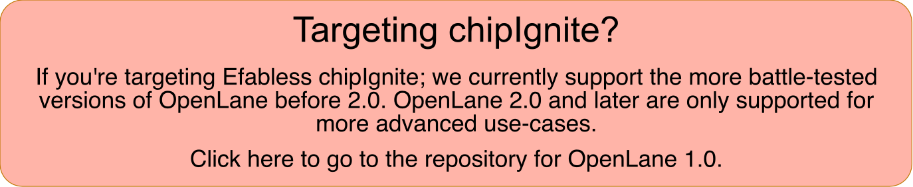
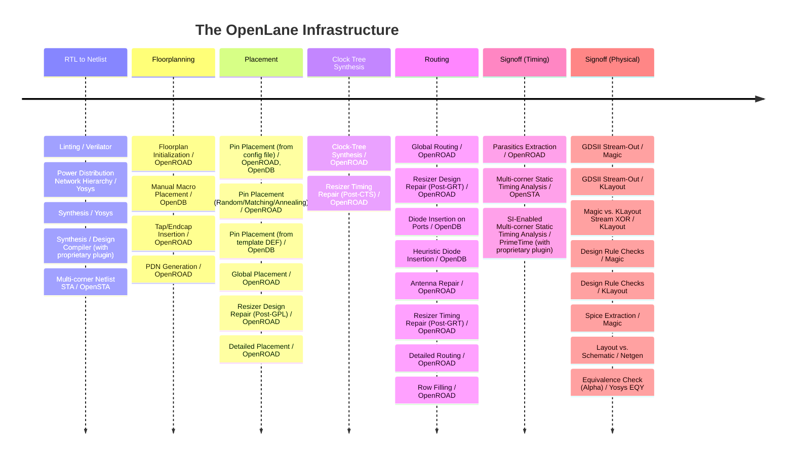

<p align="center">
    <a href="https://github.com/The-OpenROAD-Project/OpenLane">
        
    </a>
</p>

<h1 align="center">OpenLane</h1>
<p align="center">
    <a href="https://opensource.org/licenses/Apache-2.0"></a>
    <a href="https://www.python.org"></a>
    <a href="https://github.com/psf/black"></a>
    <a href="https://mypy-lang.org/"></a>
    <a href="https://nixos.org/"></a>
</p>
<p align="center">
    <a href="https://colab.research.google.com/github/efabless/openlane2/blob/main/notebook.ipynb"></a>
    <a href="https://openlane2.readthedocs.io/"></a>
    <a href="https://open-source-silicon.dev"></a>
</p>

OpenLane is an ASIC infrastructure library based on several components including
OpenROAD, Yosys, Magic, Netgen, CVC, KLayout and a number of custom scripts for
design exploration and optimization.

A reference flow, "Classic", performs all ASIC implementation steps from RTL all
the way down to GDSII.

You can find the documentation
[here](https://openlane2.readthedocs.io/en/latest/getting_started/) to get
started. You can discuss OpenLane 2 in the
[#openlane-2](https://open-source-silicon.slack.com/archives/C05M85Q5GCF)
channel of the
[Efabless Open Source Silicon Slack](https://invite.skywater.tools).



## Try it out

You can try OpenLane right in your browser, free-of-charge, using Google
Colaboratory by following
[**this link**](https://colab.research.google.com/github/efabless/openlane2/blob/main/notebook.ipynb).

## Installation

You'll need the following:

* Python **3.8** or higher with PIP, Venv and Tkinter

### Nix (Recommended)

Works for macOS and Linux (x86-64 and aarch64). Recommended, as it is more
integrated with your filesystem and overall has less upload and download deltas.

See
[Nix-based installation](https://openlane2.readthedocs.io/en/latest/getting_started/common/nix_installation/index.html)
in the docs for more info.

### Docker

Works for Windows, macOS and Linux (x86-64 and aarch64).

See
[Docker-based installation](https://openlane2.readthedocs.io/en/latest/getting_started/common/docker_installation/index.html)
in the docs for more info.

Do note you'll need to add `--dockerized` right after `openlane` in most CLI
invocations.

### Python-only Installation (Advanced, Not Recommended)

**You'll need to bring your own compiled utilities**, but otherwise, simply
install OpenLane as follows:

```sh
python3 -m pip install --upgrade openlane
```

Python-only installations are presently unsupported and entirely at your own
risk.

## Usage

In the root folder of the repository, you may invoke:

```sh
python3 -m openlane --pdk-root <path/to/pdk> </path/to/config.json>
```

To start with, you can try:

```sh
python3 -m openlane --pdk-root $HOME/.volare ./designs/spm/config.json
```

## Publication

If you use OpenLane in your research, please cite the following paper.

* M. Shalan and T. Edwards, “Building OpenLANE: A 130nm OpenROAD-based
  Tapeout-Proven Flow: Invited Paper,” *2020 IEEE/ACM International Conference
  On Computer Aided Design (ICCAD)*, San Diego, CA, USA, 2020, pp. 1-6.
  [Paper](https://ieeexplore.ieee.org/document/9256623)

```bibtex
@INPROCEEDINGS{9256623,
  author={Shalan, Mohamed and Edwards, Tim},
  booktitle={2020 IEEE/ACM International Conference On Computer Aided Design (ICCAD)}, 
  title={Building OpenLANE: A 130nm OpenROAD-based Tapeout- Proven Flow : Invited Paper}, 
  year={2020},
  volume={},
  number={},
  pages={1-6},
  doi={}}
```

## License and Information

[The Apache License, version 2.0](https://www.apache.org/licenses/LICENSE-2.0.txt).

Docker images distributed by Efabless Corporation under the same license.

Binaries bundled with OpenLane either via Cachix or Docker are distributed by
Efabless Corporation and may fall under stricter open source licenses.
