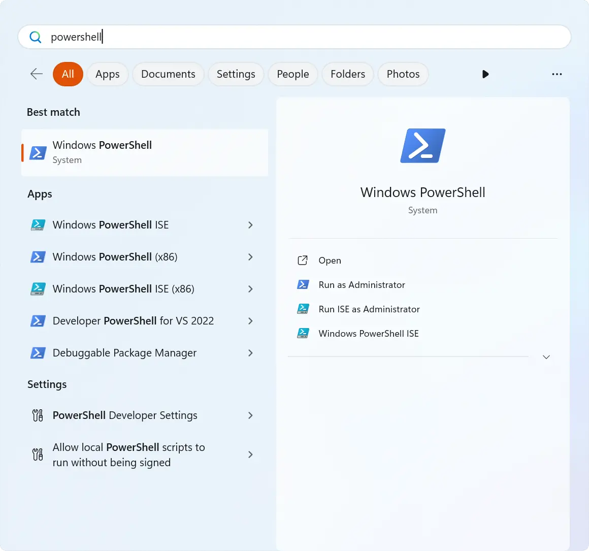

# Windows 10+

* **Minimum Requirements**
    * Windows 10 version 2004 (Build 19041 and higher)
    * Quad-core CPU running at 2.0 GHz+
    * 8 GiB of RAM
    
* **Recommended**
    * Windows 11
    * 6th Gen Intel® Core CPU or later OR AMD Ryzen™️ 1000-series or later
    * 16 GiB of RAM

The following is the recommended installation method under Windows. Other
virtualization-based methods, such as VMWare, are not supported, and some such
as VirtualBox are known to impair the operation of OpenLane.

## Setting up WSL

1. Follow
   [official Microsoft documentation for WSL located here](https://docs.microsoft.com/en-us/windows/wsl/install)
   to install the WSL 2. Make sure your OS version supports WSL 2.

1. Follow
   [official steps to Install Docker Desktop on Windows located here](https://docs.docker.com/desktop/install/windows-install/).

   * Make sure to tick `Use WSL 2 instead of Hyper-V (recommended)` during installation.
   
   
   
   * If you've previously installed Docker Desktop for Windows, ensure
     

1. Make sure that option `Start Docker Desktop when you log in` is enabled in
   `Docker Desktop` -> `Settings` and `WSL 2 Docker engine` is enabled and
   `Settings` -> `Resource` -> `WSL Integration` is enabled.

   

1. Click the Windows icon, type in "Windows PowerShell" and open it.

   

1. Install Ubuntu using the following command: `wsl --install -d Ubuntu`

1. Check the version of WSL using following command: `wsl --list --verbose`

    It should produce the following output:

    ```powershell
    PS C:\Users\user> wsl --list --verbose
    NAME                   STATE           VERSION
    * Ubuntu                 Running         2
    docker-desktop         Running         2
    docker-desktop-data    Running         2
    ```

    If you get following output, then you need to launch **Docker Desktop on
    Windows** from the start menu.

    ```powershell
    PS C:\Users\user> wsl --list --verbose
    NAME                   STATE           VERSION
    * Ubuntu                 Running         2
    docker-desktop         Stopped         2
    docker-desktop-data    Stopped         2
    ```

    Same goes for if you get an output that looks like this

    ```powershell
    PS C:\Users\user> docker run hello-world

    The command 'docker' could not be found in this WSL 2 distro.
    We recommend to activate the WSL integration in Docker Desktop settings.

    For details about using Docker Desktop with WSL 2, visit:

    https://docs.docker.com/go/wsl2/
    ```

1. Launch "Ubuntu" from your Start Menu.

    

1. Follow the steps shown below.

```{include} ../_ubuntu_packages.md
:heading-offset: 2

```


```{include} _common.md
:heading-offset: 1

```
