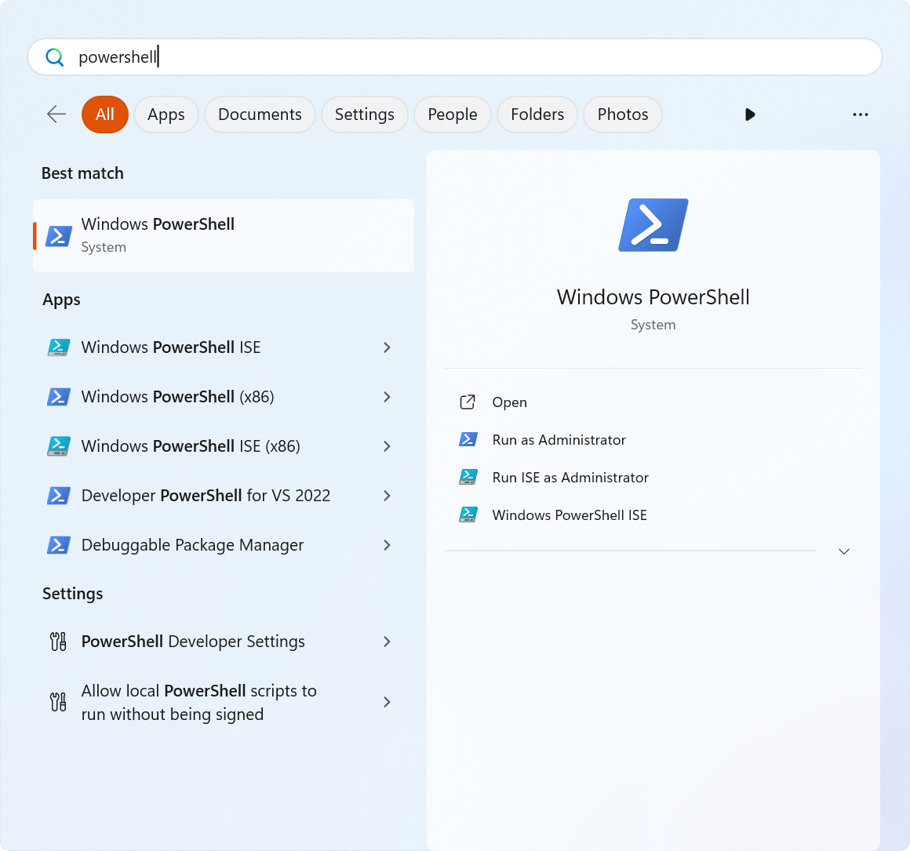
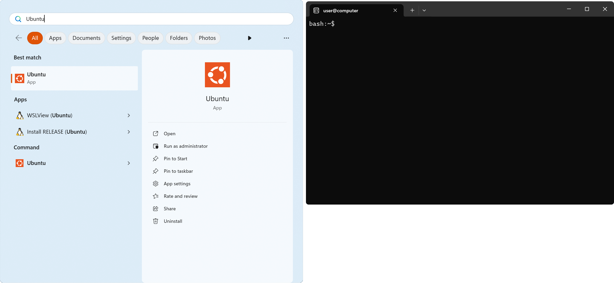

# Windows 10+

* **Minimum Requirements**
    * Windows 10 version 2004 (Build 19041 and higher)
    * Quad-core CPU running at 2.0 GHz+
    * 8 GiB of RAM
    * ~32 GiB available storage
    
* **Recommended**
    * Windows 11
    * 6th Gen Intel® Core CPU or later OR AMD Ryzen™️ 1000-series or later
    * 16 GiB of RAM
    * ~32 GiB available storage

## Setting up WSL

1. Follow [official Microsoft documentation for WSL located here](https://docs.microsoft.com/en-us/windows/wsl/install) to install the WSL 2.


```{note}
OpenLane 2 *requires* WSL2. Make sure that you're using Windows 11, or
Windows 10 is up-to-date.
```

1. Click the Windows icon, type in "Windows PowerShell" and open it.

    

1. Install Ubuntu using the following command: `wsl --install -d Ubuntu`

1. Check the version of WSL using following command: `wsl --list --verbose`

    It should produce the following output:

    ```powershell
    PS C:\Users\user> wsl --list --verbose
    NAME                   STATE           VERSION
    * Ubuntu                 Running         2
    ```

1. Launch "Ubuntu" from your Start Menu.

    

## Installing Nix

You can install Nix by following the instructions at https://nixos.org/download.html
in your WSL terminal.

```console
sudo apt-get install -y curl
sh <(curl -L https://nixos.org/nix/install) --no-daemon --yes
```

Enter your password if prompted. This should take around 5 minutes.

Make sure to close the Ubuntu terminal after you're done with this step and
start it again.

```{include} _common.md
:heading-offset: 1
```
