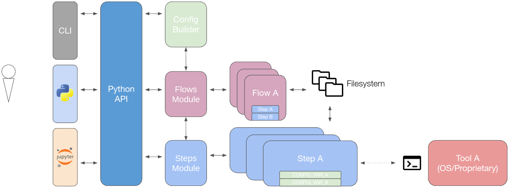
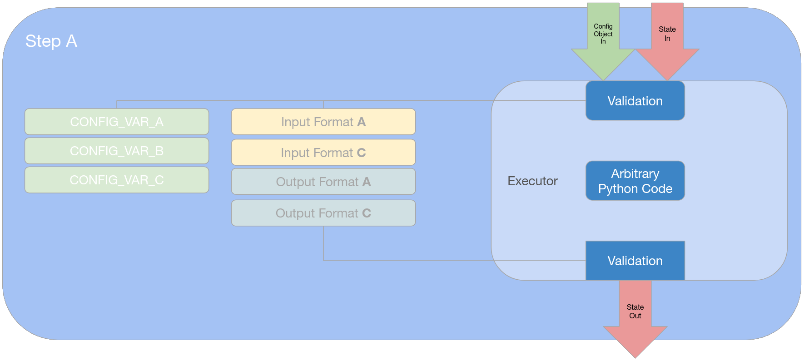

# Architectural Overview

At its core level, OpenLane is an infrastructure in which **Flows** could be built
out of multiple atomic execution units called **Steps**, and then run with a
**Configuration**.

OpenLane is architected as a Python module with the following hierarchy:



The module is accessible via Python scripts, Jupyter Notebooks and a (limited)
command-line API.

The module consists of three submodules: {mod}`openlane.flows`, {mod}`openlane.steps` and {mod}`openlane.config`.

## Steps

Steps are the primary execution unit of OpenLane.

The {class}`openlane.steps.Step` class is an [abstract base class](https://docs.python.org/3/glossary.html#term-abstract-base-class)
from which all other steps inherit.

Each step takes two inputs: a **Configuration Object** and a **State**, and
returns an **output** state as shown here:



Steps should align themselves to one principle:

- <u>The same step with the same input configuration and same input state must emit the same output.</u>

(ref-step-strictures)=
This is applied as far as the functionality goes:

- Steps **do NOT** modify files in-place. New files must be created in the step's
  dedicated directory. If the tool does not support out-of-place modification,
  copy the files then modify the copies.
- Steps **do NOT** modify the config_in. This is programmatically enforced.
- Steps **do NOT** rely on external filesystem paths. If a path is not in the
  configuration or in the input state, it effectively does not exist to the Step.
  - This applies the other way around as well: Steps **do NOT** create files
    outside of their step directory.
- Steps **do** fix [PRNG](https://en.wikipedia.org/wiki/Pseudorandom_number_generator)
  seeds for replicability. They can be exposed as a configuration variable.

More of these strictures may be programatically enforced by the infrastructure in the future.

Some aspects cannot be made entirely deterministic, such as timestamps in views, file paths and the like. These are acceptable breaks from this dogma.

### States

A {class}`openlane.steps.State` is a snapshot of paths to views at any point in
time, in dictionary form.

Keys must be of the type {class}`openlane.steps.DesignFormat` and values must be
either:

- Of the type {class}`openlane.config.Path`.
- N-nested dictionaries with key values such that the leaves are of the type
  {class}`openlane.config.Path` as well.

States also have another property: metrics. This attribute captures design
metrics, which may be read and/or updated by any step.

## Flows

Flows are scripts that incorporate multiple `Step`s to achieve a certain
function.

The {class}`openlane.flows.Flow` class is an [abstract base class](https://docs.python.org/3/glossary.html#term-abstract-base-class)
from which all other flows inherit.

### Sequential Flows

A subclass of Flows, {class}`openlane.flows.SequentialFlow` will, as the name
implies, run its declared steps in sequence with the same configuration object
and a consecutive states, i.e.

```{math}
  State_{i} = Step_{i}(State_{i - 1}, Config)
```

So, for a flow of {math}`n` steps, the final state, {math}`State_{n}` will be
the output of the entire flow.

The default flow of OpenLane when run from the command-line is a SequentialFlow
named [`Classic`](./flows.md#classic), which is based off of the
original, Tcl-based version of OpenLane.

## Configuration

### Objects

Configuration objects are a thoroughly-validated dictionary of values assigned
to various configuration variables throughout a flow.

A flow's configuration variables in an aggregate of all its incorporate steps.

The configuration object supports Python's basic scalars (except for `float`),
`Decimal`, `List` and `Dict`, the latter two infinitely nestable. Steps are given
this configuration object as an input.

### Builder

The configuration builder takes a `Flow` and a raw configuration object as an
input, which can be any of:

- A Python dictionary
- A path to an existent JSON configuration file
- A path to an existent Tcl configuration file (deprecated)

and then validates this configuration, resolving paths, fixing types and
other such tasks along the way, returning the {class}`openlane.config.Config`
class which is essentially a validated and immutable string dictionary.
